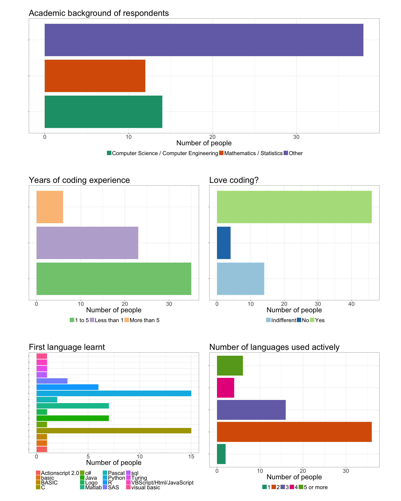
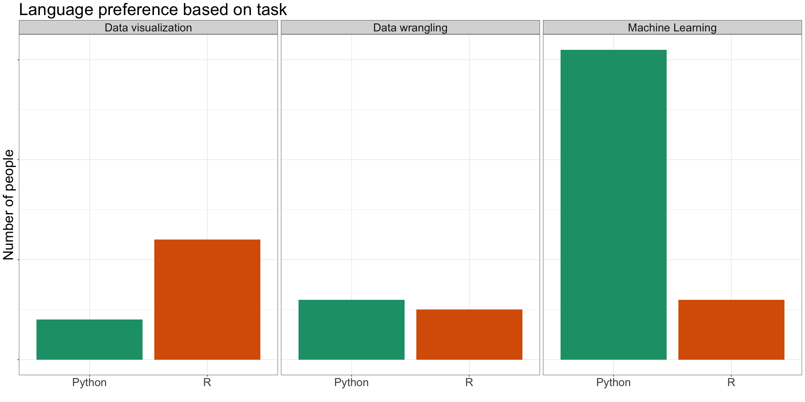
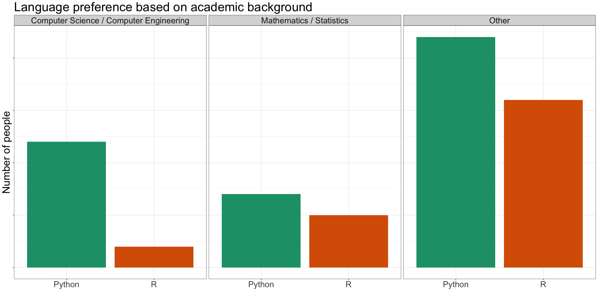
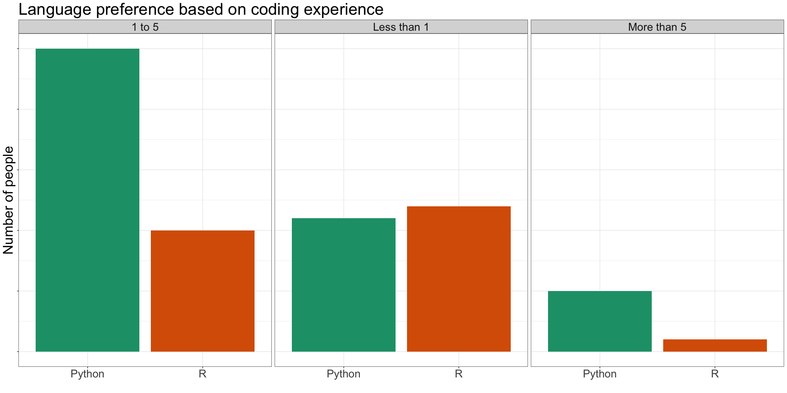
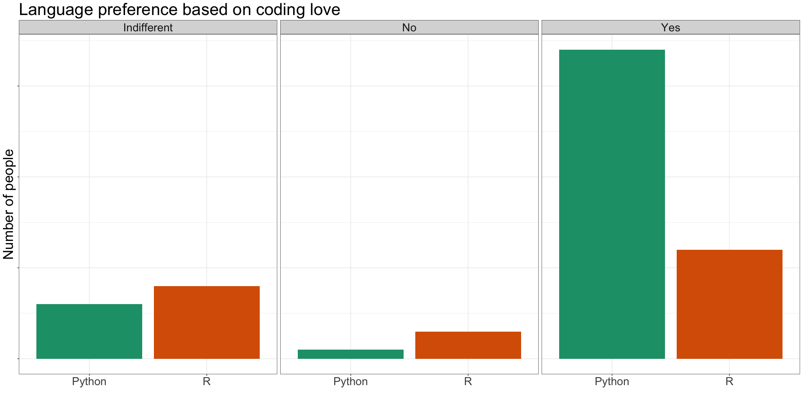
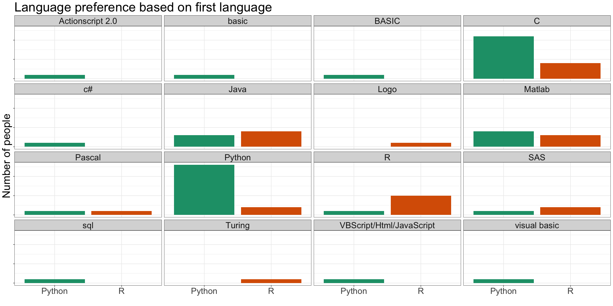
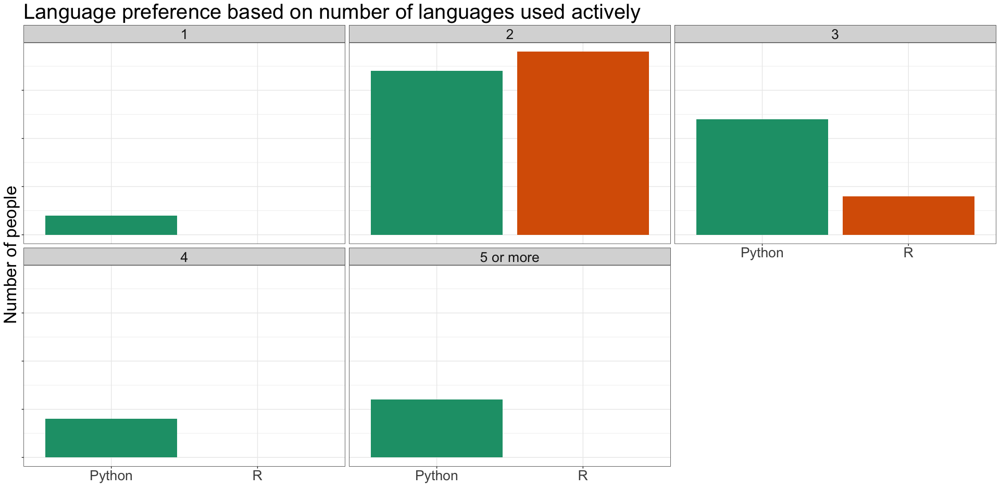

# EDA_ozum
Ozum  
April 9, 2018  

## Who are the respondents?

<!-- -->

## Language preference based on different variables

### How does favorite task affect preference of programming language?

<!-- -->

### How do the confounding variables affect preference of programming language?

<!-- --><!-- --><!-- --><!-- --><!-- -->

