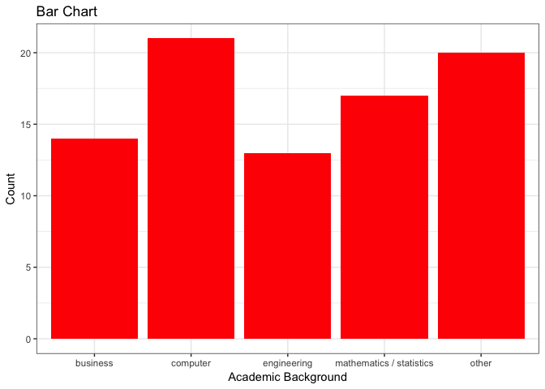
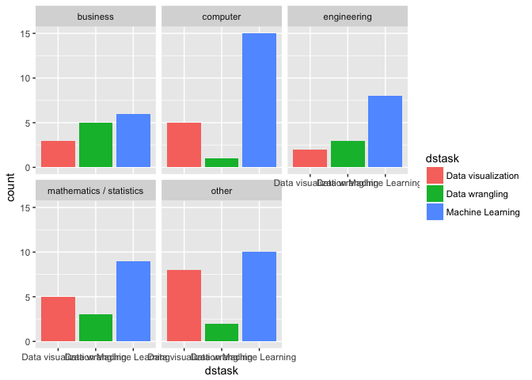
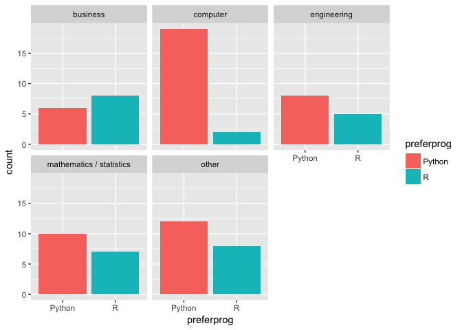
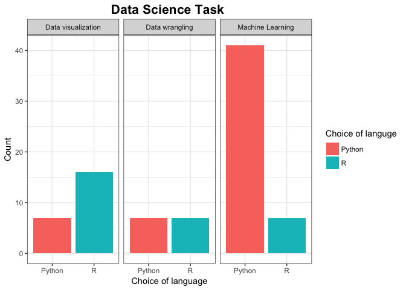
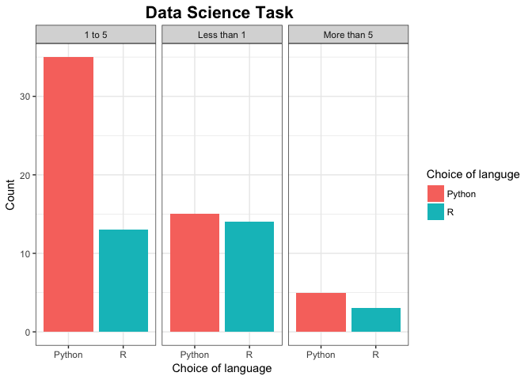
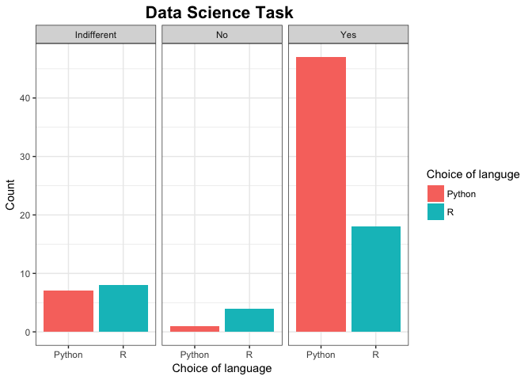

Prash\_survey\_analysis
================
prash
2018-04-09

``` r
library(tidyverse)
library(knitr)
library(stringr)
```

``` r
survey <- read_csv("../../data/survey_responses.csv")
```

``` r
kable(head(survey))
```

| Timestamp                 | This online survey company is hosted by a web survey company located in the USA and as such is subject to U.S. laws, in particular, the US Patriot Act which allows authorities access to the records of internet service providers. If you choose to participate in the survey, you understand that your responses to the survey questions will be stored and accessed in the USA. The security and privacy policy for the web survey company can be found at the following link : <https://policies.google.com/privacy> | What is your academic background? | How many years of coding experience do you have prior to using Python/R? | Do you enjoy/love coding? | Which programming language did you learn first? | Which of the following programming languages do you prefer more? | What is your favorite data science task? | How many programming languages do you use actively? |
|:--------------------------|:--------------------------------------------------------------------------------------------------------------------------------------------------------------------------------------------------------------------------------------------------------------------------------------------------------------------------------------------------------------------------------------------------------------------------------------------------------------------------------------------------------------------------|:----------------------------------|:-------------------------------------------------------------------------|:--------------------------|:------------------------------------------------|:-----------------------------------------------------------------|:-----------------------------------------|:----------------------------------------------------|
| 2018/04/09 2:30:02 PM MDT | I agree                                                                                                                                                                                                                                                                                                                                                                                                                                                                                                                   | Business                          | Less than 1                                                              | Yes                       | SAS                                             | Python                                                           | Data visualization                       | 3                                                   |
| 2018/04/09 2:30:05 PM MDT | I agree                                                                                                                                                                                                                                                                                                                                                                                                                                                                                                                   | Electrical Engineering            | Less than 1                                                              | Yes                       | C                                               | Python                                                           | Machine Learning                         | 3                                                   |
| 2018/04/09 2:45:19 PM MDT | I agree                                                                                                                                                                                                                                                                                                                                                                                                                                                                                                                   | Geography                         | Less than 1                                                              | Indifferent               | R                                               | R                                                                | Data visualization                       | 2                                                   |
| 2018/04/09 2:53:19 PM MDT | I agree                                                                                                                                                                                                                                                                                                                                                                                                                                                                                                                   | Mathematics / Statistics          | 1 to 5                                                                   | Indifferent               | Java                                            | Python                                                           | Machine Learning                         | 2                                                   |
| 2018/04/09 3:05:15 PM MDT | I agree                                                                                                                                                                                                                                                                                                                                                                                                                                                                                                                   | Mathematics / Statistics          | Less than 1                                                              | Indifferent               | Pascal                                          | R                                                                | Data wrangling                           | 2                                                   |
| 2018/04/09 3:05:50 PM MDT | I agree                                                                                                                                                                                                                                                                                                                                                                                                                                                                                                                   | Engineering                       | 1 to 5                                                                   | Yes                       | Java                                            | R                                                                | Data visualization                       | 2                                                   |

``` r
survey_analysis <- survey %>% 
  select(-c(1,2)) 


colnames(survey_analysis) <- c("academic","codingexp","lovecoding","firstprog","preferprog","dstask","noofprog")
```

``` r
kable(head(survey_analysis))
```

| academic                 | codingexp   | lovecoding  | firstprog | preferprog | dstask             | noofprog |
|:-------------------------|:------------|:------------|:----------|:-----------|:-------------------|:---------|
| Business                 | Less than 1 | Yes         | SAS       | Python     | Data visualization | 3        |
| Electrical Engineering   | Less than 1 | Yes         | C         | Python     | Machine Learning   | 3        |
| Geography                | Less than 1 | Indifferent | R         | R          | Data visualization | 2        |
| Mathematics / Statistics | 1 to 5      | Indifferent | Java      | Python     | Machine Learning   | 2        |
| Mathematics / Statistics | Less than 1 | Indifferent | Pascal    | R          | Data wrangling     | 2        |
| Engineering              | 1 to 5      | Yes         | Java      | R          | Data visualization | 2        |

``` r
survey_analysis %>% group_by(preferprog)%>% 
  summarize(count=n()) %>% 
  kable()
```

| preferprog |  count|
|:-----------|------:|
| Python     |     55|
| R          |     30|

``` r
#survey_analysis$academic <- str_replace(tolower(survey_analysis$academic),c(".*econ.*",".*fin.*",".*business.*"),"Business")


#survey_analysis$academic <- str_replace(tolower(survey_analysis$academic),c(".*econ.*",".*fin.*",".*business.*"),"Business")


#?str_replace
#survey_analysis$academic <- str_replace(survey_analysis$academic,"Mathematics / Statistics","Math & Stats")

survey_analysis$academic <- str_replace(survey_analysis$academic,"Computer Science / Computer Engineering","computer")

survey_analysis$academic <- str_replace(tolower(survey_analysis$academic),".*econ.*","business")

survey_analysis$academic <- str_replace(tolower(survey_analysis$academic),".*busi.*","business")

survey_analysis$academic <- str_replace(tolower(survey_analysis$academic),".*eng.*","engineering")


# Creating a vector, putting all the fields to others 

survey_clean_1 <- c("business","computer","engineering","mathematics / statistics")

#interact_clean$name[!(interact_clean$name %in% interact_clean_1)] <- "other"

survey_analysis$academic[!(survey_analysis$academic%in% survey_clean_1)] <- "other"


# Summary 
survey_analysis_count<- survey_analysis %>% 
  group_by(academic) %>% 
  summarise(count=n()) %>% 
  View()
```

``` r
survey_analysis %>% 
  ggplot(aes(academic))+geom_bar(fill="red",position = "dodge")+
  labs(title="Bar Chart",x="Academic Background",y="Count") +
  theme_bw()
```



``` r
 survey_analysis %>% 
  ggplot() +
  geom_bar(aes(x = dstask,fill = dstask)) +
  facet_wrap(~academic) 
```



``` r
 survey_analysis %>% 
  ggplot() +
  geom_bar(aes(x = preferprog,fill = preferprog)) +
  facet_wrap(~academic) 
```



``` r
survey_analysis %>% 
  ggplot() +
  geom_bar(aes(x = preferprog,fill = preferprog)) +
  facet_wrap(~dstask)+theme_bw()+
  scale_fill_discrete(name = "Choice of languge")+
   ggtitle("Data Science Task ")+xlab("Choice of language") + ylab("Count")+
  theme(plot.title = element_text(hjust = 0.5,face="bold",size=16))
```



``` r
survey_analysis %>% 
  ggplot() +
  geom_bar(aes(x = preferprog,fill = preferprog)) +
  facet_wrap(~codingexp)+theme_bw()+
  scale_fill_discrete(name = "Choice of languge")+
   ggtitle("Data Science Task ")+xlab("Choice of language") + ylab("Count")+
  theme(plot.title = element_text(hjust = 0.5,face="bold",size=16))
```



``` r
survey_analysis %>% 
  ggplot() +
  geom_bar(aes(x = preferprog,fill = preferprog)) +
  facet_wrap(~lovecoding)+theme_bw()+
  scale_fill_discrete(name = "Choice of languge")+
   ggtitle("Data Science Task ")+xlab("Choice of language") + ylab("Count")+
  theme(plot.title = element_text(hjust = 0.5,face="bold",size=16))
```


